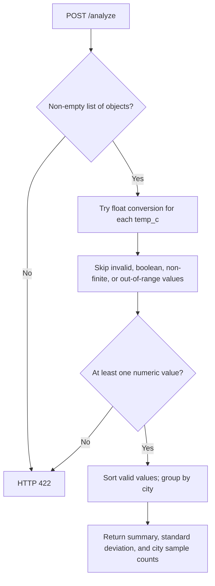
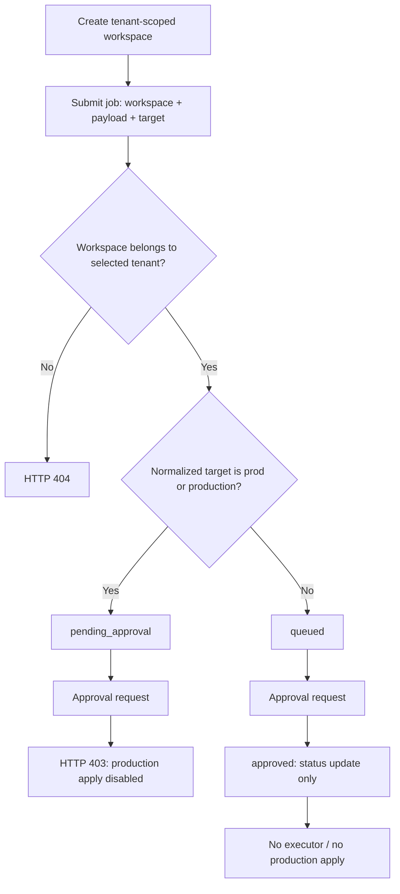

# Weather Data Analyzer: process flows

## Domain request

Endpoint: `POST /analyze`. Input: rows with city and temp_c. The processing stages below summarize [analyze.py](../src/weather/analyze.py); they are local function behavior, not externally executed tools.

Refusal responses, where implemented, are normal domain results rather than successful execution of a requested write. Detailed edge cases are covered in [INTERVIEW_QA.md](../INTERVIEW_QA.md).

## Workspace and job approval

Approval first checks job ownership using the selected tenant. Status changes and audit records remain in memory. Repeated lab approval returns the original approval without duplicating its event or counter. Ops transitions are protected by an in-process lock. The domain request flow and this job-record flow are independent. Source: [ops.py](../src/weather/ops.py).
